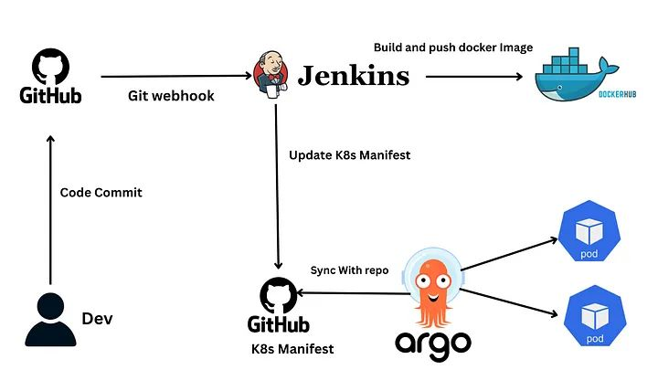

# 🚀 DevOps CI/CD Pipeline Project

A **complete, production-style DevOps project** integrating **Terraform, Ansible, Jenkins, Docker, Kubernetes, Argo CD, Prometheus, and Grafana**. This project demonstrates a modern CI/CD workflow with GitOps, observability, and infrastructure automation

---

## 📌 Technologies Used

| Purpose                | Tool                       |
|------------------------|----------------------------|
| Infrastructure as Code | Terraform                  |
| Configuration Mgmt     | Ansible                    |
| CI/CD Pipeline         | Jenkins                    |
| Containerization       | Docker                     |
| Container Orchestration| Kubernetes (K8s)           |
| GitOps Deployment      | Argo CD                    |
| Monitoring             | Prometheus, Grafana        |

---

## 🧠 Architecture Overview



### 🔹 Breakdown:
- **Terraform** provisions all AWS infrastructure (EC2, Security Groups, etc.)
- **Ansible** configures the EC2 instances (Docker, Jenkins, K8s setup)
- **Jenkins** automates the pipeline: builds Docker image and pushes to Docker Hub
- **Kubernetes** deploys the containerized app
- **Argo CD** automatically syncs K8s deployments via Git (GitOps)
- **Prometheus + Grafana** provide real-time monitoring and alerts

---

## 📁 Folder Structure

```

project-root/

├── terraform/

├── ansible/

├── app/

│   ├── app.py

│   ├── Dockerfile

│   └── requirements.txt

├── kubernetes/

│   ├── deployment.yaml

│   ├── service.yaml

│   └── prometheus-rule.yaml

├── Jenkinsfile

├── docs/

│   └── images/

│       ├── prometheus\_ui.png

│       ├── grafana\_dashboard.png

│       ├── argo\_cd\_dashboard.png

│       └── architecture\_diagram.png

└── README.md


---

## 🔨 Step-by-Step Project Setup

### ✅ Step 1: Provision Infrastructure with Terraform

```bash
cd terraform
terraform init
terraform fmt 
terraform validate
terraform plan 
terraform apply
````

Resources Created:

* VPC
* EC2 Instances (Jenkins, Web, Control node)
* Security Groups
* IAM Roles

---

### ✅ Step 2: Configure Servers with Ansible

```bash
cd ansible
ansible-playbook playbooks/install-docker.yml
ansible-playbook playbooks/setup-jenkins.yml
```

Tasks Performed:

* Docker installation
* Jenkins installation
* SSH key setup
* Firewall configuration

---

### ✅ Step 3: Jenkins CI Pipeline

---

### ✅ Step 4: Deploy to Kubernetes via Argo CD (GitOps)

```bash
kubectl create namespace argocd
kubectl apply -n argocd -f https://raw.githubusercontent.com/argoproj/argo-cd/stable/manifests/install.yaml
kubectl port-forward svc/argocd-server -n argocd 8090:443
```

Access Argo CD UI at:
**[https://localhost:8090](https://localhost:8090)**

Create an Argo CD application pointing to the GitHub repo folder `kubernetes/`.

**Screenshot Example:**
.png)

---

### ✅ Step 5: Monitoring Setup (Prometheus + Grafana)

Install with Helm:

```bash
helm repo add prometheus-community https://prometheus-community.github.io/helm-charts
helm install prometheus prometheus-community/kube-prometheus-stack -n monitoring --create-namespace
```

Forward ports:

```bash
kubectl port-forward svc/prometheus-kube-prometheus-prometheus -n monitoring 9090
kubectl port-forward svc/prometheus-grafana -n monitoring 3000:80
```

* **Grafana Login**: `admin / prom-operator`
* **Add Prometheus** as data source

---

### ✅ Step 6: Custom Alerts (Example)

```yaml
apiVersion: monitoring.coreos.com/v1
kind: PrometheusRule
metadata:
  name: high-cpu-alert
  namespace: monitoring
spec:
  groups:
  - name: instance-rules
    rules:
    - alert: HighCPUUsage
      expr: process_cpu_seconds_total > 0.5
      for: 2m
      labels:
        severity: warning
      annotations:
        summary: \"High CPU usage detected\"
```

---

## 🖼️ Screenshots

| Interface  | Screenshot                                    |
| ---------- | --------------------------------------------- |
| Argo CD    | .pngg)    |
| Prometheus | .png)  |
| Grafana    | .png) |


---

## 📚 Summary

| Feature                 |
| ----------------------- |  
| ✅ Terraform (IaC)       
| ✅ Ansible (Config Mgmt) 
| ✅ Jenkins (CI/CD)        
| ✅ Docker                 
| ✅ Kubernetes Deployment |  
| ✅ Argo CD (GitOps)      |  
| ✅ Prometheus & Grafana  |  
| ✅ Custom Alerts         |  

---

## 💬 Contribution & License

* Developed by: \[**devkelzs**]

